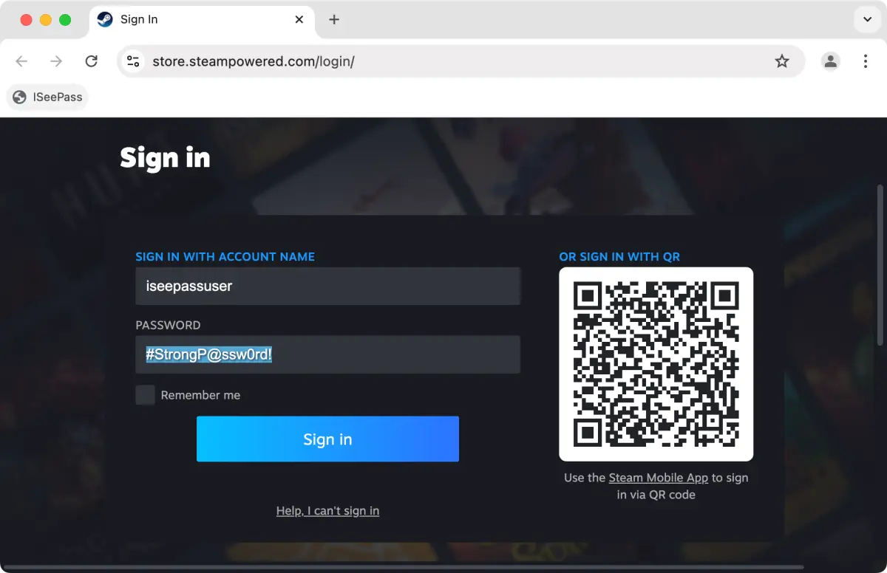

# ISeePass

ISeePass is a bookmarklet that reveals hidden passwords on web pages. It helps you verify password accuracy, recover forgotten passwords, and copy passwords. The bookmarklet is compatible with all major browsers and operating systems and doesn't require installation. Simply drag it to your browser's bookmarks bar and click it to reveal passwords. ISeePass allows you to toggle between showing and hiding passwords on demand. By using ISeePass, you can save time and frustration when dealing with hidden passwords.

**By providing the free ISeePass bookmarklet, [East-Tec](https://www.east-tec.com/) aims to emphasize the vulnerability of passwords stored in browsers. This underscores the importance of prioritizing password security by employing encryption and [securely deleting](https://www.east-tec.com/eraser/) personal information.**

| ISeePass revealing a password on macOS | 
| :---: |
|  |

## Contributions

All contributions are welcome: code, documentation, graphics, design suggestions, and more. Please fork this repository and contribute back using [pull requests](https://github.com/tecdrop/iseepass/pulls). For feature requests and bug reports please [submit an issue](https://github.com/tecdrop/iseepass/issues).

## License

ISeePass is licensed under the [GNU General Public License v3.0](LICENSE).
